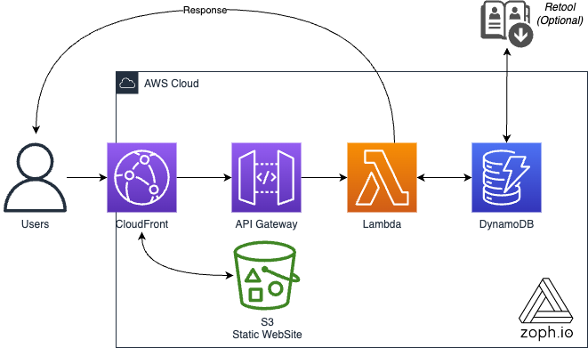
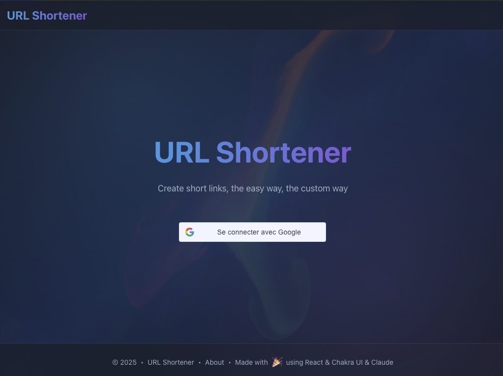
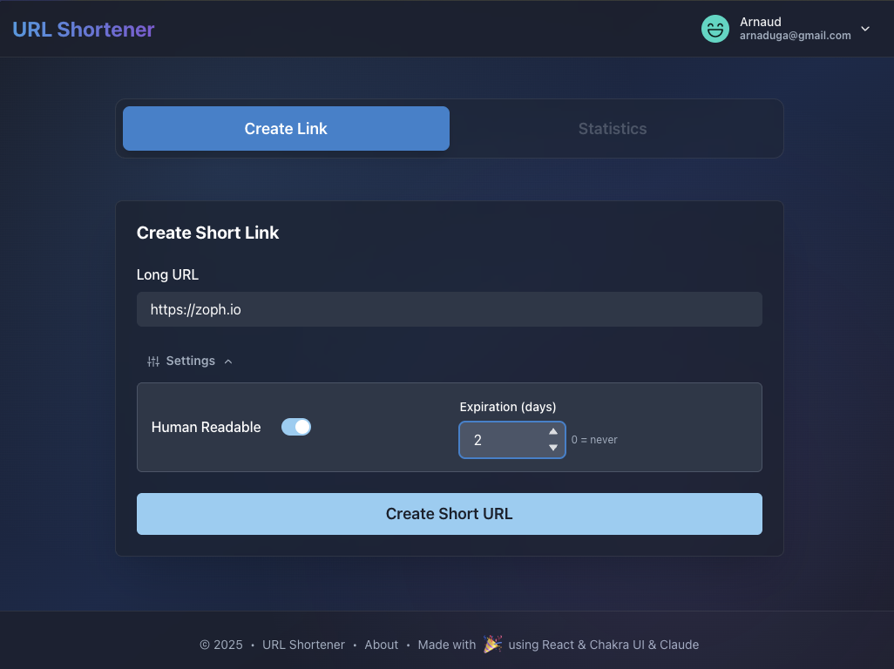
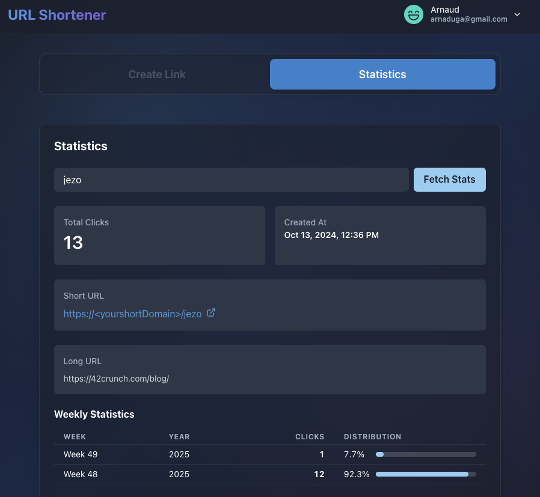

# 🔗 url-shortener

## 💡 Features

1. **Google OAuth Authentication** - Secure access with Google Identity Services
2. **Modern React Frontend** - Built with React, Vite, and Chakra UI
3. **RESTful API** - Create short URLs and fetch statistics
4. **Custom Short IDs** - Human-readable option for memorable links
5. **TTL Support** - Set expiration dates for your short links
6. **Analytics Dashboard** - Track clicks with weekly statistics
7. **Companion Static Website** - Single Page Application (SPA)
   - [CORS](https://developer.mozilla.org/en-US/docs/Web/HTTP/CORS) and [CSP](https://developer.mozilla.org/en-US/docs/Web/HTTP/CSP) compliant
   - Responsive design with dark mode
8. **Click Counter** - Detailed analytics persisted in DynamoDB

## 🔋 Powered by

**Frontend:**

- React 18 with Vite
- Chakra UI component library
- Google Identity Services for authentication

**Backend:**

- AWS Lambda (Python 3.10)
- API Gateway with Lambda Authorizer
- DynamoDB for data persistence
- CloudFront + S3 for static hosting
- ACM for SSL certificates
- CloudFormation + SAM for infrastructure as code

## 📐 Schema



## 🚀 Usage

### Pre-requirements

1. **AWS Certificate** - You will need an already issued AWS Certificate Manager (ACM) wildcard Certificate in `us-east-1` AWS region: `*.{your_domain}`
2. **Google OAuth Client** - Create a Google OAuth 2.0 Client ID from [Google Cloud Console](https://console.cloud.google.com/apis/credentials)
   - Add authorized JavaScript origins: `https://short.{your_domain}`
   - No redirect URIs needed (uses Google Identity Services)
3. **Route53 Hosted Zone** - Your domain must be managed by AWS Route53
4. **Configure Parameters** - Update the `Makefile` with your specific values

#### 🎛 Parameters

| Parameters      | Default Value   | Description                                                     |
| --------------- | --------------- | --------------------------------------------------------------- |
| Product         | `url-shortener` | Product Name                                                    |
| Project         | `<yourProject>` | Project Name                                                    |
| Environment     | `prod`          | Environment Name                                                |
| MinChar         | `3`             | Minimum characters for the random shortened link id             |
| MaxChar         | `4`             | Maximum characters for the random shortened link id             |
| Domain          | `<yourDomain>`  | Desired Domain (must be linked to the `HostedZoneId` Parameter) |
| SubDomain       | `NONE`          | Subdomain for API (use `NONE` for root domain)                  |
| HostedZoneId    | `Required`      | AWS Route53 `HostedZoneId` where your domain name belongs       |
| FallbackUrl     | `<yourURL>`     | When the url does not exist, fallback url                       |
| AWSRegion       | `eu-west-1`     | AWS Region                                                      |
| AlertsRecipient | `Required`      | Email of the recipient of CloudWatch Alarms                     |
| GoogleClientId  | `Required`      | Google OAuth 2.0 Client ID for authentication                   |

### Deployment

```bash
# Deploy backend infrastructure (API Gateway, Lambda, DynamoDB)
$ make deploy # or make -f YourMakeFile deploy

# Build and deploy React frontend to S3/CloudFront
$ make setup_front # or make -f YourMakeFile setup_front
```

The deployment will create:

- **Backend API**: `https://{Domain}/` (or `https://{SubDomain}.{Domain}/` if SubDomain is set)
- **Frontend SPA**: `https://short.{Domain}/`

### How to use the URL Shortener?

#### Using the Web Interface (Recommended)

After deployment, navigate to `https://short.{Domain}` where you'll find a modern React application with:

1. **Authentication**: Sign in with your Google account
2. **Create Short Links**:
   - Enter long URL
   - Toggle human-readable option for memorable short IDs
   - Set expiration (0-3650 days, 0 = never expires)
3. **Statistics Dashboard**: View click analytics and weekly statistics for your short links

**Home page screenshot:**



**Creation section screenshot:**



**Statistics section screenshot:**



> **Note**: Only authorized Google accounts (configured in DynamoDB `users` table) can access the application.

#### Using the API directly

**Authentication Required**: Include a valid Google ID token in the `Authorization` header.

##### Create a short URL

```bash
curl -X POST https://{domain}/create \
  --header "Content-Type: application/json" \
  --header "Authorization: Bearer {your_google_id_token}" \
  -d '{"long_url": "https://google.com"}'
```

**Optional parameters:**

- `ttl_in_days` (integer, default: 7): Set expiration in days (0 = never expires)
- `human_readable` (boolean, default: false): Generate memorable consonant/vowel combinations

**Example with all options:**

```bash
curl -X POST https://{domain}/create \
  --header "Content-Type: application/json" \
  --header "Authorization: Bearer {your_google_id_token}" \
  -d '{
    "long_url": "https://google.com",
    "ttl_in_days": 365,
    "human_readable": true
  }'
```

**Response:**

```json
{
  "short_id": "baho",
  "created_at": "2024-08-24T15:28:04",
  "ttl": 1724772484,
  "short_url": "https://{domain}/baho",
  "long_url": "https://google.com"
}
```

##### Get statistics

```bash
curl -X GET https://{domain}/stats/{short_id} \
  --header "Authorization: Bearer {your_google_id_token}"
```

**Response:**

```json
{
  "short_id": "baho",
  "long_url": "https://google.com",
  "short_url": "https://{domain}/baho",
  "created_at": "2024-08-24T15:28:04",
  "total_hits": 42,
  "weekly_stats": [
    { "week": "2024-W34", "clicks": 15 },
    { "week": "2024-W35", "clicks": 27 }
  ]
}
```

> **Note**: Generated short IDs are lowercase to avoid confusion.

## 🔐 Authorization Setup

To authorize users to access the application:

1. Add authorized email addresses to the DynamoDB `users` table:

   ```bash
   aws dynamodb put-item \
     --table-name users \
     --item '{"email": {"S": "user@example.com"}}'
   ```

2. Or use the AWS Console:
   - Navigate to DynamoDB → Tables → `users`
   - Create item with `email` attribute

## 🏗️ Architecture

The application follows a serverless SPA architecture:

- **Frontend**: React SPA hosted on S3/CloudFront
- **Authentication**: Google Identity Services (client-side)
- **API**: API Gateway with Lambda Authorizer validating Google ID tokens
- **Backend**: Python Lambda functions
- **Database**: DynamoDB for URLs, stats, and authorized users

For detailed architecture documentation, see [docs/ARCHITECTURE.md](docs/ARCHITECTURE.md)

## 📖 Reference

- [Google Identity Services Documentation](https://developers.google.com/identity/gsi/web/guides/overview)
- [Original inspiration](https://blog.ruanbekker.com/blog/2018/11/30/how-to-setup-a-serverless-url-shortener-with-api-gateway-lambda-and-dynamodb-on-aws/)
- [CloudFront secure static site](https://github.com/aws-samples/amazon-cloudfront-secure-static-site/tree/master)

## 🙏 Credits

- Original implementation inspired by [zoph-io/url-shortener](https://github.com/zoph-io/url-shortener)
- Frontend redesign with React and OAuth integration (v2.0.0) and the help of Anthropic Claude

## 📝 License

MIT License - see LICENSE file for details
